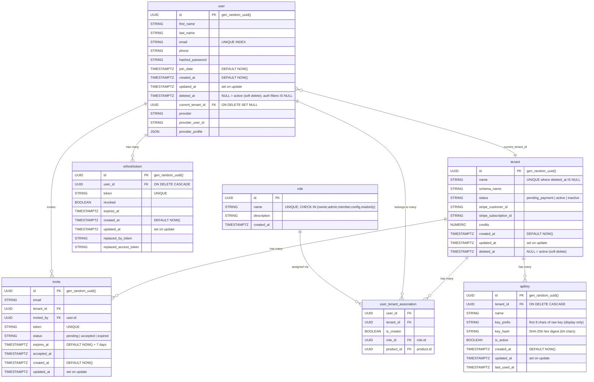

# Database Schema v1 — TGS Voice Agent Platform

## Ticket → Table Name Mapping

| Ticket concept | Actual table name | Model class   |
|---------------|-------------------|---------------|
| workspaces    | `tenant`          | `Tenant`      |
| users         | `user`            | `User`        |
| api_keys      | `apikey`          | `Apikey`      |
| invitations   | `invite`          | `Invite`      |
| sessions      | `refreshtoken`    | `RefreshToken`|

---

## Role System

### Canonical Role Names (stored in the `role` table)

| `role.name` | Ticket concept | Access level |
|-------------|----------------|--------------|
| `owner`     | admin (creator) | Full access; created automatically on workspace registration |
| `admin`     | admin           | Full access; can manage users, config, and data |
| `member`    | —               | Standard member; can use the platform within their product |
| `config`    | config          | Can configure workspace settings; **cannot** manage users |
| `readonly`  | readonly        | Read-only; blocked from any mutating endpoint |

### RBAC Dependency Mapping (`app/api/deps.py`)

| FastAPI dependency      | Roles allowed                      | Notes                                      |
|-------------------------|------------------------------------|--------------------------------------------|
| `require_owner`         | `owner`                            | Workspace creator flows only               |
| `require_admin`         | `admin`                            | Admin-only endpoints (invites, agent CRUD) |
| `require_admin_or_owner`| `admin`, `owner`                   | Destructive ops (workspace delete, etc.)   |
| `require_config`        | `owner`, `admin`, `config`         | Settings / configuration endpoints         |
| `require_readonly`      | `owner`, `admin`, `member`, `config`, `readonly` | Read endpoints; any tenant member |
| `require_member`        | any role in tenant                 | Blocks `readonly` on POST/PUT/PATCH/DELETE |
| `require_member_or_admin`| any role in tenant                | Blocks `readonly` on write HTTP methods    |

### Role enforcement in auth flows
- All user lookups in JWT middleware, login, refresh, and forgot-password flows
  filter `User.deleted_at IS NULL`. A soft-deleted user is treated as non-existent
  and receives 401 with `"account has been deactivated"`.
- `require_member` / `require_member_or_admin` reject `readonly` on
  `POST`, `PUT`, `PATCH`, `DELETE` (GET/list/read endpoints still work).

---

## ER Diagram (Mermaid)



---

## Index Inventory

| Table         | Index name                    | Columns                  | Type            |
|---------------|-------------------------------|--------------------------|-----------------|
| `tenant`      | `uq_tenant_name_active`       | `name` (partial: `deleted_at IS NULL`) | UNIQUE partial |
| `tenant`      | `ix_tenant_deleted_at`        | `deleted_at`             | BTree           |
| `user`        | `ix_user_email` (implicit)    | `email`                  | UNIQUE          |
| `user`        | `ix_user_deleted_at`          | `deleted_at`             | BTree           |
| `apikey`      | `ix_apikey_key_hash_tenant_id`| `key_hash, tenant_id`    | BTree composite |
| `apikey`      | `ix_apikey_tenant_id`         | `tenant_id`              | BTree           |
| `invite`      | `ix_invite_email_tenant_id`   | `email, tenant_id`       | BTree composite |

---

## Migration Chain (core table changes)

| Migration file                            | What it does                                                    |
|-------------------------------------------|-----------------------------------------------------------------|
| `01a225a67ca1_add_apikey_table_...`       | Creates `apikey` table                                          |
| `20260516_add_apikey_key_prefix`          | Adds `apikey.key_prefix`                                        |
| `20260517_apikey_composite_index`         | Adds composite index on `apikey(key_hash, tenant_id)`           |
| `20260518_add_tenant_deleted_at`          | Adds `tenant.deleted_at` + index                                |
| `20260518_tenant_name_unique_active`      | Adds partial unique index on `tenant(name)` where not deleted   |
| `20260521_schema_v1_gaps`                 | `updated_at` on all 5 core tables; `user.deleted_at`; FK `ON DELETE SET NULL`; `invite` composite index; `gen_random_uuid()` DB defaults |
| `20260521_role_config_readonly`           | Inserts `config` + `readonly` roles; CHECK on `role.name`       |
| `20260521_merge_heads`                    | Merges stripe + schema v1 branches (single Alembic head)        |

---

## Verification Commands

```bash
# 1. Apply all migrations (single head)
alembic upgrade head

# 2. Verify migration is reversible
alembic downgrade -1   # reverts merge revision (noop)
alembic upgrade head   # re-applies

# 3. Seed a local dev workspace + admin user (idempotent)
python scripts/seed_dev_workspace.py

# 4. Verify seed user can log in (should return JWT)
curl -s -X POST http://localhost:8000/api/v1/users/login \
  -H "Content-Type: application/json" \
  -d '{"email":"admin@dev.local","password":"dev-password-change-me"}' | python3 -m json.tool

# 5. Run schema unit tests
python3 -m pytest tests/db/ -v
```

---

## Seed Script

File: `scripts/seed_dev_workspace.py`

Creates:
- Tenant: `dev-workspace`
- User: `admin@dev.local` / `dev-password-change-me` (bcrypt hash — can log in via API)
- `user_tenant_association` with `role_id` → `admin` role and `is_creator=True`
- All 5 canonical roles (`owner`, `admin`, `member`, `config`, `readonly`) if missing

Idempotent: safe to run multiple times.
