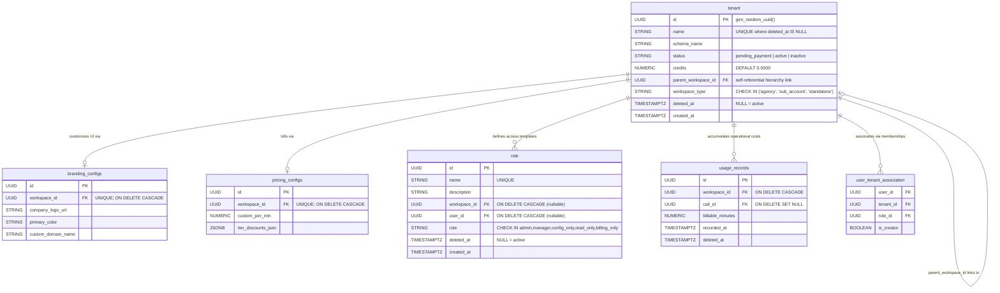

# Database Schema v3 — TGS Hierarchical Multi-Tenant Platform

## Ticket → Table Name Mapping

| Ticket concept           | Actual table name     | Model class      | Notes                                                 |
|--------------------------|-----------------------|------------------|-------------------------------------------------------|
| `workspaces` / `tenants` | `tenant`              | `Tenant`         | Upgraded with hierarchy fields                        |
| `branding_configs`       | `branding_configs`    | `BrandingConfig` | 1:1 with `tenant` via cascading FK                     |
| `pricing_configs`        | `pricing_configs`     | `PricingConfig`  | 1:1 with `tenant` via cascading FK                     |
| `usage_records`          | `usage_records`       | `UsageRecord`    | High-throughput billing ledger; module-qualified paths|

---

## Hierarchical Tenant Structural Conversions

The `tenant` table transitions from a flat workspace concept into an **Adjacency List** model supporting tree hierarchies.

| Column                | Type           | Modifiers                                 | Purpose                                                        |
|-----------------------|----------------|-------------------------------------------|----------------------------------------------------------------|
| `workspace_type`      | VARCHAR / TEXT | NOT NULL, DEFAULT 'standalone'            | Segregates account types: `agency`, `sub_account`, `standalone` |
| `parent_workspace_id` | UUID           | FK `tenant.id`, ON DELETE SET NULL        | Links child Sub-Accounts directly back to an Agency root       |
| `credits`             | NUMERIC(10, 4) | NOT NULL, DEFAULT 0.0000                  | Precision balances tracking real-time platform operational costs|

### Inheritance Strategy


```

```
       ┌──────────────────────────────┐
       │   Agency Workspace           │
       │   (type: 'agency')           │
       └──────────────┬───────────────┘
                      │
        ┌─────────────┴─────────────┐
        ▼                           ▼

```

┌───────────────────────┐   ┌───────────────────────┐
│ Sub-Account A         │   │ Sub-Account B         │
│ (type: 'sub_account') │   │ (type: 'sub_account') │
└───────────────────────┘   └───────────────────────┘

```

* **Agency Context:** Governs billing configurations, optional domain branding modifications, and sub-account provisions.
* **Sub-Account Context:** Inherits constraints from its configured `parent_workspace_id`. Dedicated assets like `Agent`, `CallFlow`, and local `UsageRecord` ledger rows route here.
* **Standalone Context:** Backwards-compatible fallback behavior mimicking the classic V2 isolated space.

---

## Soft-Delete Convention

| Table              | Soft-delete column | Type        | Notes                        |
|--------------------|--------------------|-------------|------------------------------|
| `tenant`           | `deleted_at`       | TIMESTAMPTZ | NULL = active                |
| `usage_records`    | `deleted_at`       | TIMESTAMPTZ | Soft-delete ledger exception |
| All Core V2 Tables | (Retained)         | —           | Untouched downstream paths   |

*Cascade Rules*: Deleting an Agency workspace issues an internal database trigger or app-layer background worker processing loop soft-deleting downstream child entities.

---

## Fine-Grained Billing & Configurations

V3 extracts branding overrides and granular per-minute platform pricing matrices into dedicated configuration scopes.

### 1. `pricing_configs` Storage

| Column             | Type           | Modifiers                           | Notes                                                |
|--------------------|----------------|-------------------------------------|------------------------------------------------------|
| `id`               | UUID           | PRIMARY KEY                         | Automatically generated token                        |
| `workspace_id`     | UUID           | FK `tenant.id`, UNIQUE, CASCADE     | Absolute strict 1:1 tenant coupling                  |
| `custom_per_min`   | NUMERIC(10, 4) | NOT NULL, DEFAULT 0.0000            | Custom base rate tier overrides                      |

### 2. High-Throughput `usage_records` Ledger

To avoid locking issues on hot execution frames, real-time call tracking aggregates rows directly into `usage_records`.

| Column             | Type           | Modifiers                           | Notes                                                |
|--------------------|----------------|-------------------------------------|------------------------------------------------------|
| `id`               | UUID           | PRIMARY KEY                         | Record unique reference identifier                   |
| `workspace_id`     | UUID           | FK `tenant.id`, CASCADE             | Isolates ledger entry targeting a single sub-account |
| `call_id`          | UUID           | FK `call_sessions.id`, SET NULL     | Traces cost back to an isolated audio execution stream|
| `billable_minutes` | NUMERIC(10, 2) | NOT NULL                            | Raw compute usage duration track                     |
| `recorded_at`      | TIMESTAMPTZ    | SERVER DEFAULT func.now()           | Absolute ledger insertion timestamp tracking         |

---

## Deploy Runbook (Schema V3 Completion)

Execute **in order** across lower environments before updating deployment environments.

### Step 1 — Verify Model Paths
Confirm that SQLAlchemy compiles relationships explicitly using module-qualified strings. Both sides of the association tree must mirror absolute target spaces to bypass duplicate workspace registry namespace conflicts:

```python
# app/models/tenant.py
usage_records = relationship("app.models.usage_records.UsageRecord", back_populates="tenant", cascade="all, delete-orphan")

# app/models/usage_records.py
tenant = relationship("Tenant", back_populates="usage_records")

```

### Step 2 — Apply Migration

```bash
alembic upgrade head 2>&1 | tee /tmp/alembic-schema-v3.log

```

---

## ER Diagram (Mermaid)



---

## Index Inventory (v3 additions)

| Table | Index name | Columns | Type |
| --- | --- | --- | --- |
| `tenant` | `idx_tenants_parent_workspace_id` | `parent_workspace_id` | BTree |
| `usage_records` | `idx_usage_records_workspace_recorded` | `workspace_id, recorded_at` | BTree composite |

---

## Constraint Inventory (v3)

| Table | Constraint name | Definition |
| --- | --- | --- |
| `tenant` | `chk_tenant_workspace_type` | `workspace_type IN ('agency', 'sub_account', 'standalone')` |

---

## Verification Commands

Follow this execution loop to verify complete local environment stability:

```bash
# 1. Apply schema changes safely
alembic upgrade head

# 2. Run idempotent seeder (Validates Agency & Sub-Account isolation boundaries)
python scripts/seed_dev_workspace.py

# 3. Target V3 regression testing modules explicitly
python3 -m pytest tests/db/test_hierarchical_billing.py -v

```

```

```